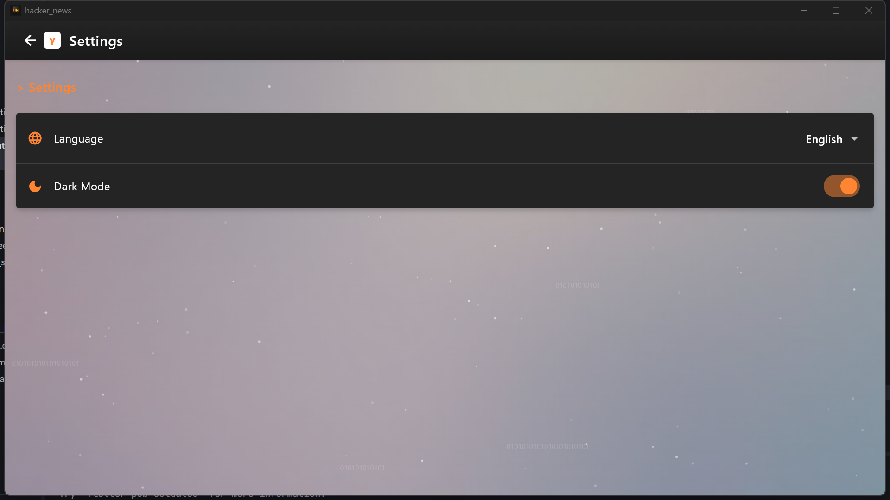

# Hacker News App

[中文版](README.md) | English

A Hacker News client application developed with Flutter, providing a smooth user experience and rich features.


## Features

- **Real-time News**: Get the latest tech news and discussions from the Hacker News API
- **Multi-language Support**: Support for English and Chinese interfaces, easily switch languages
- **Dark Mode**: Built-in day/night theme switching function to protect your eyes
- **Responsive Design**: Adapts to devices with various screen sizes
- **Pull-to-refresh**: Easily get the latest content
- **Detailed Reading**: Support for viewing news details and comments
- **Open in External Browser**: Open original links in the system browser

## Technical Architecture

### Project Structure

```
lib/
├── l10n/                  # Localization and internationalization
├── models/                # Data models
├── providers/             # State management
├── screens/               # Application interfaces
├── services/              # API services
├── theme/                 # Theme configuration
├── widgets/               # Reusable components
└── main.dart              # Application entry
```

### Technologies and Libraries Used

- **Flutter**: UI framework
- **Provider**: State management
- **HTTP**: Network requests
- **Timeago**: Time formatting
- **Pull to Refresh**: Pull-to-refresh functionality
- **Flutter Localizations**: Internationalization support

## Installation and Running

1. Ensure Flutter development environment is installed
2. Clone this repository
3. Install dependencies:
   ```
   flutter pub get
   ```
4. Run the application:
   ```
   flutter run
   ```

## Screenshots



## Contribution

Issues and pull requests are welcome to improve this application together!

## License

This project is licensed under the MIT License - see the LICENSE file for details